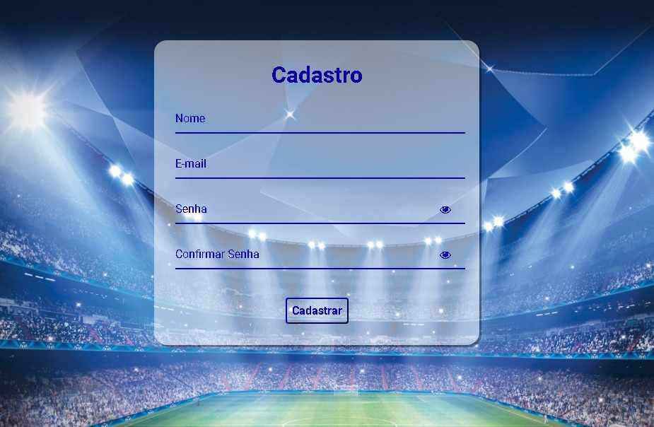

# Indice
- [Sobre](#-sobre)
- [Modelo 1 - Login](#-Modelo-1---Login)
- [Modelo 2 - Cadastro](#-Modelo-2---Cadastro)

## 📑 Sobre

Tela de Login e Cadastro.

## 📩 Modelo 1 - Login

Tela de Login

<h3 align="center">
  <a href="https://github.com/vitorborqge/Cadastro-e-Login">Acessar demonstração</a>
</h3>

## 📩 Modelo 2 - Cadastro

Tela de Cadastro

<h3 align="center">
  <a href="https://github.com/vitorborqge/Cadastro-e-Login">Acessar demonstração</a>
</h3>

    

🚀 Tecnologias utilizadas

✔️ HTML5 
  

✔️ CSS3 

✔️ JS 
  

  
  Feito por Vitorborqge
